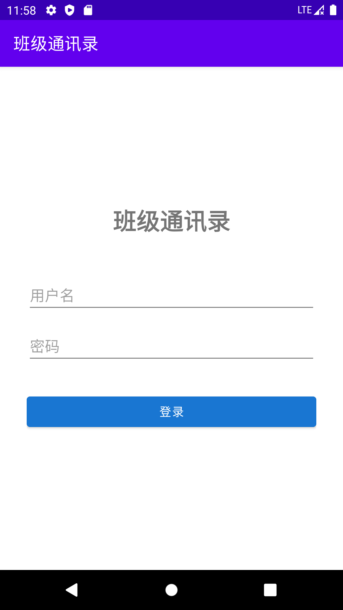
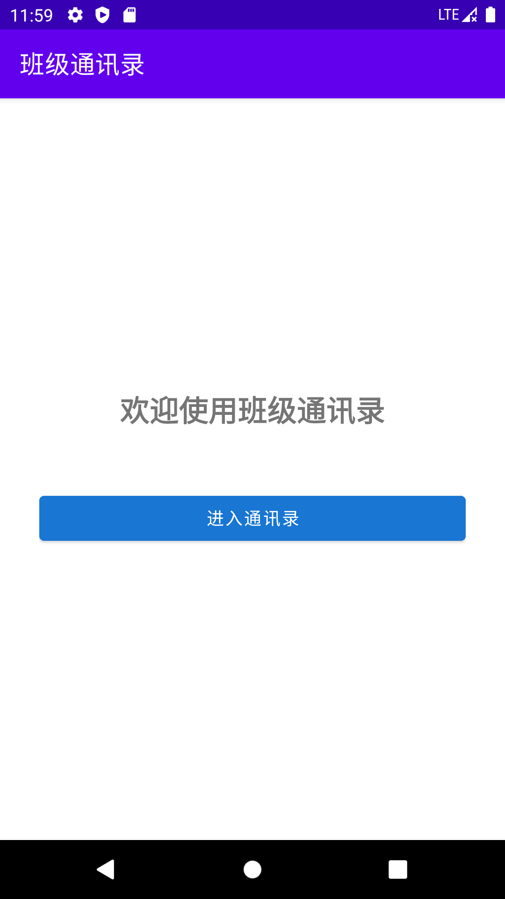
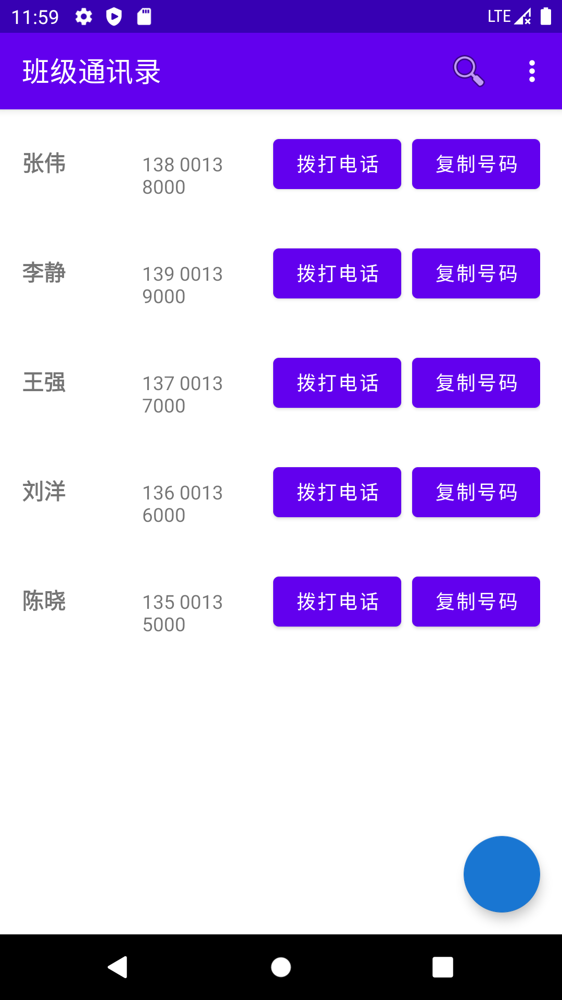
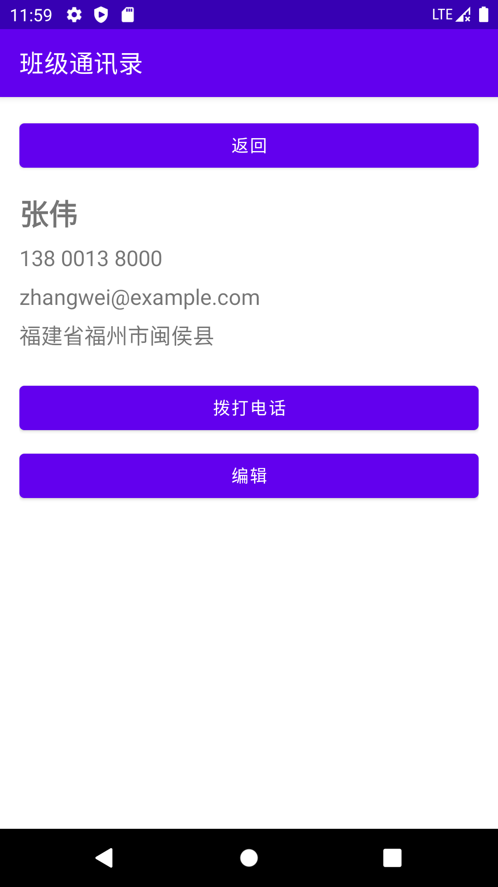

# 班级通讯录 App

一个用 Java 写的 Android 通讯录应用，覆盖从登录到增删改查的完整闭环。

## 界面预览

| 登录 | 主页 | 联系人列表 | 联系人详情 |
|:---:|:---:|:---:|:---:|
|  |  |  |  |

> 截图取自 Android 11（API 30）模拟器实机运行，列表中的联系人数据为演示用示例数据。

## 功能

- 6 个页面：登录、主页、联系人列表、详情、新增、编辑
- 联系人完整增删改查，数据存本地 SQLite
- 按姓名 / 电话模糊搜索
- 4 种排序方式
- 一键拨号、复制号码到剪贴板

## 技术栈

- 语言：Java
- 平台：Android SDK（minSdk 21，即 Android 5.0 及以上）
- 存储：SQLite（`SQLiteOpenHelper`）
- UI：`RecyclerView` + ViewHolder、AndroidX、Material Components
- 构建：Gradle

## 项目结构

```
app/src/main/java/com/example/myapplication20/
├── LoginActivity.java          登录页
├── HomeActivity.java           主页
├── ContactListActivity.java    联系人列表（搜索 + 排序）
├── ContactDetailActivity.java  联系人详情
├── AddContactActivity.java     新增联系人
├── EditContactActivity.java    编辑联系人
├── Contact.java                实体类，实现 Serializable
├── ContactDatabaseHelper.java  SQLiteOpenHelper，封装增删改查
├── ContactAdapter.java         RecyclerView 适配器
├── SearchUtil.java             模糊搜索
├── SortManager.java            排序
└── PhoneUtils.java             拨号 / 复制到剪贴板
```

## 怎么跑起来

1. 用 Android Studio 打开本目录（Open an Existing Project）
2. 等待 Gradle 同步完成
3. 连接手机或启动模拟器，点 Run

## 实现说明

- **页面间传值**：`Contact` 实现 `Serializable`，通过 `Intent` 在页面间传递
- **一键拨号**：用 `Intent.ACTION_DIAL` 拉起系统拨号盘，不需要申请拨号权限
- **列表复用**：`RecyclerView` + ViewHolder，点击事件通过接口回调处理
- **数据操作**：增删改查统一封装在 `ContactDatabaseHelper`，各页面复用同一套方法
- **登录校验**：课设演示用的本地账号校验（写在 `LoginActivity.java`）；正式项目中应放到服务端完成，密码不能硬编码在客户端

## 代码统计

- Java 代码 655 行 / 12 个文件
- 6 个 Activity，1 张 SQLite 表

## 说明

这是安卓程序设计课程设计项目（2026.05–2026.06），独立完成。
